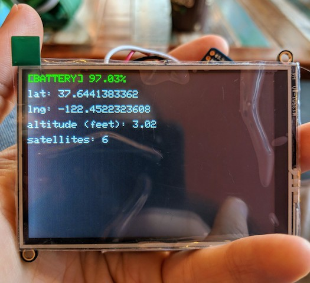
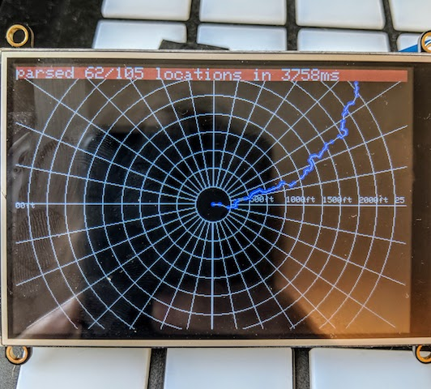

# gpstracker
Solar-powered GPS tracker that displays user's track, saving it to kml file on sd card. Running on [Adafruit Feather M0 Adalogger](https://www.adafruit.com/product/2796).

## proof of concept: print gps coordinates

## displaying the initial section of the Russian River East Fork from SD card
Only locations visible on-screen are drawn. Concentric circles indicate distance from current location (at center).

## overview

### minimum viable product:
Solar-powered GPS tracker that displays user's track, saving it to kml file on sd card.

### goal features:
- [ ] draws other kml tracks on sd card (different color than curr track)
- <del>[ ] can scroll touchscreen by 'dragging' (WON'T DO: Adafruit TFT display draws too slowly for this!)</del>
- [X] can zoom in/out (display units change from feet to miles when zoomed out sufficiently)
- [X] concentric circles centered on user location denoting distances

## materials

### microcontroller
- [adalogger](https://www.adafruit.com/product/2796) >>[overview](https://learn.adafruit.com/adafruit-feather-m0-adalogger/overview) >>[specs](https://cdn-learn.adafruit.com/downloads/pdf/adafruit-feather-m0-adalogger.pdf)

### sensors
- [GPS](https://www.adafruit.com/product/746)

### interface
- [touchscreen](https://learn.adafruit.com/adafruit-3-5-tft-featherwing/overview) >>[specs](https://cdn-learn.adafruit.com/downloads/pdf/adafruit-3-5-tft-featherwing.pdf)

COMPARE TO:
- [e-ink](https://learn.adafruit.com/adafruit-eink-display-breakouts) >>[specs](https://cdn-learn.adafruit.com/downloads/pdf/adafruit-eink-display-breakouts.pdf)

### power
- [solar lithium charger](https://www.adafruit.com/product/390)
- [solar panel](https://www.adafruit.com/product/3809)
- [battery](https://www.adafruit.com/product/2011)

## steps

### wiring
- [ ] hook up materials.

### Arduino IDE Setup
- follow steps here: https://learn.adafruit.com/adafruit-feather-m0-basic-proto/setup
#### boards
- Tools > Boards Manager: 
- Arduino SAMD Boards
- Adafruit SAMD Boards
#### libraries
- copy [Adafruit_GPS](https://github.com/adafruit/Adafruit_GPS) to Documents/Arduino/libraries/
- Tools > Manage Libraries > 
- Adafruit HX8357
- Adafruit STMPE610
- Adafruit GFX

### reinstalling Arduino
- delete:
- App
- Documents/Arduino
- Documents/Arduino15 (why is this not always existing? it needs to be deleted...)

### GPS
- [X] print current gps coord on screen

### SD

#### basic gps polling
- [X] poll gps every n seconds & write to csv: p0,p1,p2,...
- [X] read from SD & display most recent locations

#### write kml
- [ ] write & read from [kml](./kml.md) file instead of csv

### RAM test (read large kml)
Adafruit Feather M0 Adalogger has "256KB of FLASH + 32KB of RAM". kml files often exceed 32KB. Test reading a large file like [this 715KB one](./examples/kml/costa_rica_track.kml). 

KML will be stored on the SD card. You probably want to read the file in small chunks, keeping only points whose lat, lng coords translate to pixels that are visible on the display. This may not efficiently support map scrolling, as the entire kml would need to be re-processed only to use most of the same points as before. 

Maybe another file on the SD card is a list of coords sorted such that those closest to the current GPS position are first. When a current location is obtained, all list elements increase by one position? This assumes you're moving slow enough to not jump many points, right?

Or maybe your track on the SD card remains CSV and powering off or pressing a button formats it as KML, or maybe offload this to a python script run on the user's computer; this would be easier to parameterize.

### display gps track
- [X] translate gps coords to screen pos (user's current location is screen center)
- [X] filter current track gps coords to only points that are visible on screen
- [X] draw circle for all visible gps points
- [X] draw lines connecting all visible gps points
